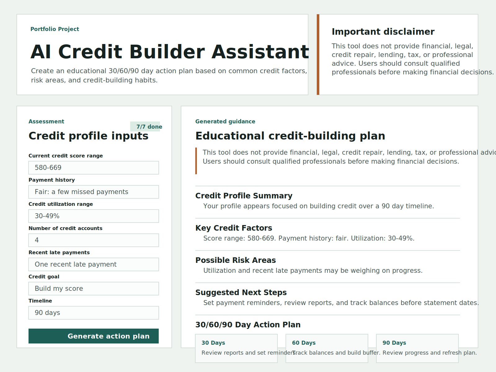

# AI Credit Builder Assistant

AI Credit Builder Assistant is a recruiter-ready full-stack portfolio project that helps users understand common credit factors and generate an educational 30/60/90 day credit-building action plan.

> This tool does not provide financial, legal, credit repair, lending, tax, or professional advice. Users should consult qualified professionals before making financial decisions.

## Features

- Responsive React assessment form with accessible labels, validation-friendly inputs, loading state, and error handling.
- Express API with server-side validation for score range, utilization, timeline, and required profile fields.
- Deterministic mock AI recommendation engine that generates profile summaries, key factors, risk areas, next steps, a 30/60/90 day plan, and educational resources.
- Clear disclaimer visible on the page and repeated in generated results.
- Basic API tests covering valid and invalid request paths.

## Tech Stack

- React + Vite
- Node.js + Express
- CSS only
- Node test runner
- Mock AI recommendation engine
- Optional future OpenAI configuration through `.env.example`

## Architecture

```text
client/        React + Vite frontend
server/        Express API and recommendation engine
screenshots/   Project screenshots for README
README.md      Project documentation
.env.example   Optional environment configuration
```

The client submits the assessment to `POST /api/recommendations`. The server validates each field, calls the mock recommendation engine, and returns structured educational guidance. The frontend renders the response as a profile summary, factor list, risk list, next steps, timeline, and resources.

## Installation

```bash
npm install
```

## Usage

Start the API:

```bash
npm run dev
```

Start the client in another terminal:

```bash
npm --workspace client run dev
```

Build the production frontend:

```bash
npm run build
```

Run tests:

```bash
npm test
```

## Screenshot



## Why I Built It

I built this project to demonstrate a practical full-stack workflow around a real user need: turning complicated credit concepts into a clear educational action plan. It shows frontend UX, backend validation, structured API responses, testing, and responsible AI disclaimers.

## What I Learned

- How to structure a lightweight full-stack React and Express portfolio app.
- How to keep AI-style recommendations deterministic and testable before adding a live model.
- How to design user-facing financial education tools with clear boundaries and disclaimers.
- How to validate inputs on the server so generated results never depend on malformed data.

## Future Improvements

- Add authenticated saved plans and progress tracking.
- Add downloadable PDF summaries.
- Add charts for utilization and timeline progress.
- Add optional OpenAI integration behind environment variables.
- Add end-to-end browser tests.

## Disclaimer

This tool does not provide financial, legal, credit repair, lending, tax, or professional advice. Users should consult qualified professionals before making financial decisions.

## Author

Olabode Moses Jimoh

GitHub: [https://github.com/Jimbol2023](https://github.com/Jimbol2023)
